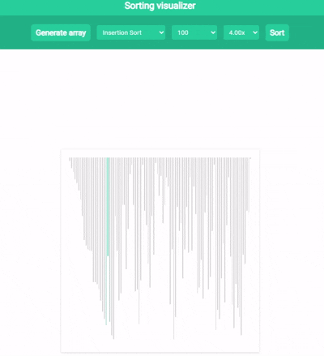

# Sorting Algorithm Visualizer

This is a web application built using **HTML**, **CSS**, and **JavaScript** to visualize classic sorting algorithms. It aims to help beginners understand and visualize how sorting algorithms work by animating their operations step by step.

## Purpose

I created this sorting visualizer to enhance my skills in **HTML**, **CSS**, and **JavaScript** while simultaneously offering a useful tool for programming beginners. By visualizing sorting algorithms, users can gain a deeper understanding of their inner workings, behavior, and time complexity. This application is perfect for students or anyone interested in learning about sorting algorithms in a more interactive and engaging way.

## Sorting Algorithms Supported

This application supports the following popular sorting algorithms:

1. **Bubble Sort**  
   Bubble Sort is one of the simplest sorting algorithms. It repeatedly steps through the list, compares adjacent elements, and swaps them if they are in the wrong order. This process is repeated until the list is sorted.

2. **Insertion Sort**  
   Insertion Sort builds the final sorted array one item at a time. It is much like sorting playing cards in your hands by inserting each card in the correct position.

3. **Selection Sort**  
   Selection Sort divides the list into two parts: a sorted part and an unsorted part. It repeatedly selects the smallest element from the unsorted part and swaps it with the first unsorted element, expanding the sorted part.

4. **Merge Sort**  
   Merge Sort is a divide-and-conquer algorithm. It divides the array into two halves, sorts them recursively, and then merges the sorted halves back together.

5. **Quick Sort**  
   Quick Sort also uses the divide-and-conquer technique. It selects a 'pivot' element and partitions the array into two parts: elements smaller than the pivot and elements larger than the pivot. It recursively sorts the two partitions.

## Features

- **Real-time Visualization**: Watch the sorting process in action as elements are rearranged in real-time.
- **Step-by-Step Control**: Control the speed of the sorting algorithm or let it run automatically.
- **Multiple Sorting Options**: Choose any of the supported sorting algorithms and visualize how each one sorts the array.
- **Responsive Design**: The application is designed to be responsive and work seamlessly on both desktop and mobile devices.

## Demo

Here is a GIF demonstrating how the visualizer works:

## Technologies Used

- **HTML** for the structure of the application.
- **CSS** for styling and layout.
- **JavaScript** for implementing the sorting algorithms and the interactive visualization.

## Future Improvements

- **Add More Algorithms**: Add more sorting algorithms such as Heap Sort, Radix Sort, etc.
- **Improved UI/UX**: Enhance the design to make the visualizer even more interactive and user-friendly.
- **Algorithm Comparison**: Add a feature to compare the time complexities and performance of different sorting algorithms in real-time.

